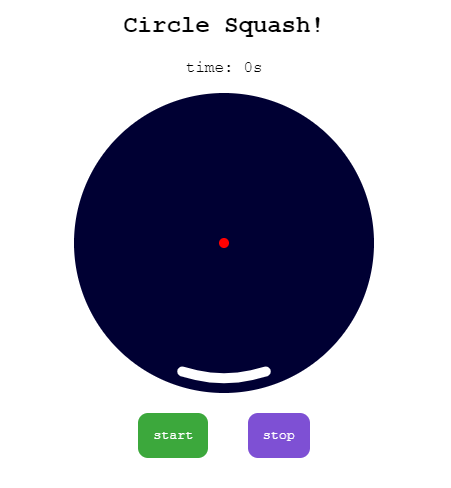

# Circle Squash

created on: apr-24-2024

## TL;DR if you just want to play!
[Play here!](https://codepen.io/tjstoll/full/PogLVZJ)

Use your mouse, or your finger to move the paddle and don't let the ball touch the wall!

Note: the keyboard controls are a sham...! Sorry to laptop users.

## What
At the beginning of my game dev journey I followed [an MDN tutorial](https://developer.mozilla.org/en-US/docs/Games/Tutorials/2D_Breakout_game_pure_JavaScript) to build a game a 2D breakout game. It ended up more like a squash type game with the ball just bouncing off the walls in predictable patterns. A little while later, I decided to make the game circular with random ball behaviour. Thus, [*Circle Squash*](https://codepen.io/tjstoll/full/PogLVZJ) was born.

## Why
Why not?! It's an interesting math problem to go from cartesian coordinates to polar coordinates but needing to rely on both simultaneously to make the game work. There's also an added layer of complexity because the orientation of the circle is different in JavaScript than what is taught in math class. Read on to see what I mean.

## How
In this discussion I assume you already have knowledge of geometry, the canvas element, and working with JavaScript.

### Step 1: Imagine the game mechanics
How do I imagine the basic game to look and feel?
- The playing field (court) is a circle instead of a square
- The ball moves freely about the circle like it did in regulate squash. Except this time it cannot touch the walls
- The ball must deflect off the paddle to keep the game in play
- Deflection of the ball is independant of what angle it deflects from the paddle (random)

### Step 2: Implement the game mechanics
There are a couple things to note before implementting the mechanics of this games.
1. The canvas elememt is measured in cartesian coordinates with the origin (0,0) at the upper left corner
2. The JavaScript canvas arc method begins the path of a circle (0°) at 90° from its usual position

_To be continued..._
